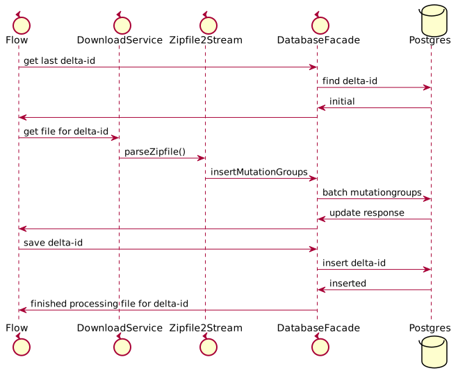
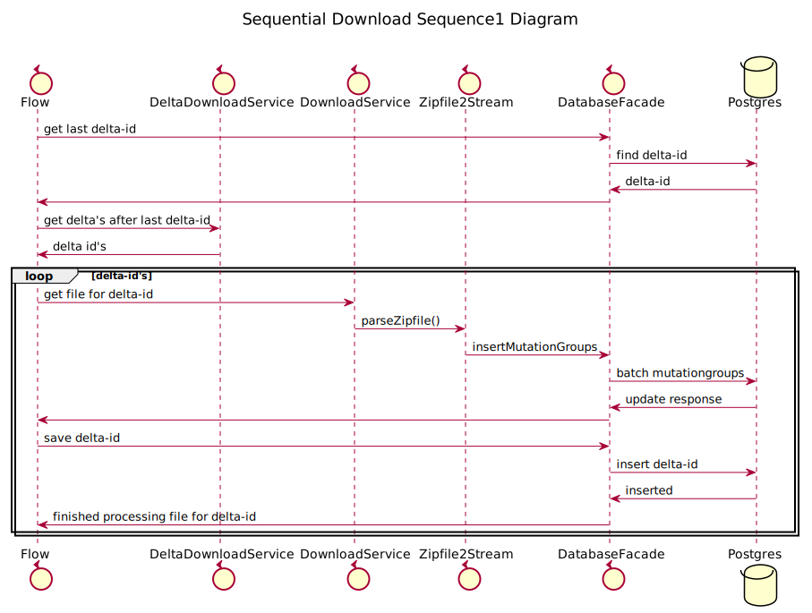

# Delta Download Ref Impl

Download API

This document contains information regarding the use of the Download API, especially the Delta Predefined endpoints are implemented.

## Delta Endpoints
Delta endpoints are used to build up your own administration (initial delivery) and
update it periodically with the available changes.

Delta downloads only contain information about the feature types associated with a dataset

### Method
1. A start position is downloaded with the Delta Custom or Delta Predefined endpoint,
by calling it without parameter delta id.
The download contains information about which delta ID it is.

2. Periodically (preferably daily) the Delta endpoint is called to get the Delta IDs
which have arisen since the delta ID determined in step 1.
3. For each Delta ID found in Step 2, it becomes Delta Custom or Delta Predefined endpoint
called with parameter delta id.
The content of these downloads only contains the mutations that have taken place in that relevant delta.

### Predefined
The setup here is the same as the full predefined downloads. However
the delta endpoint in the request can optionally be specified with the delta-id parameter
see steps 1 and 3 under method.

## Requirements

Building the API client library requires:
1. Java 1.14+
2. Maven 3.6.3
3. docker-compose (need 100 GB dkk, 500GB BGT free disk space ) or working postgres sql server
4. additional 5 Gb space on temp drive

## Program SynchronizeDatabase

### Initial download    
<!--
 
@startuml img/programInitial

control Flow

control DownloadService
control Zipfile2Stream

control DatabaseFacade
database Postgres

Flow -> DatabaseFacade: get last delta-id
DatabaseFacade -> Postgres : find delta-id
Postgres -> DatabaseFacade: initial
DatabaseFacade -> Flow

Flow -> DownloadService : get file for delta-id
DownloadService -> Zipfile2Stream : parseZipfile()
Zipfile2Stream -> DatabaseFacade : insertMutationGroups
DatabaseFacade -> Postgres : batch mutationgroups
Postgres -> DatabaseFacade: update response
DatabaseFacade -> Flow
Flow -> DatabaseFacade: save delta-id
DatabaseFacade -> Postgres: insert delta-id
Postgres -> DatabaseFacade: inserted
DatabaseFacade -> Flow: finished processing file for delta-id

@enduml

-->



### Subsequent download

<!-- 
@startuml img/programSubsequent

title __Sequential Download Sequence1 Diagram__\n

control Flow

control DeltaDownloadService
control DownloadService
control Zipfile2Stream

control DatabaseFacade
database Postgres

Flow -> DatabaseFacade: get last delta-id
DatabaseFacade -> Postgres : find delta-id
Postgres -> DatabaseFacade: delta-id
DatabaseFacade -> Flow

Flow -> DeltaDownloadService: get delta's after last delta-id
DeltaDownloadService -> Flow : delta id's

loop delta-id's
Flow -> DownloadService : get file for delta-id
DownloadService -> Zipfile2Stream : parseZipfile()
Zipfile2Stream -> DatabaseFacade : insertMutationGroups
DatabaseFacade -> Postgres : batch mutationgroups
Postgres -> DatabaseFacade: update response
DatabaseFacade -> Flow
Flow -> DatabaseFacade: save delta-id
DatabaseFacade -> Postgres: insert delta-id
Postgres -> DatabaseFacade: inserted
DatabaseFacade -> Flow: finished processing file for delta-id
end

@enduml

-->



### Test
To test de reference implementation, simply execute:

```shell
mvn clean test
```

### Running database docker-compose

```shell
cd database
docker-compose up -d 
```

create database by hand resource :
- database/database.sql

### Running
Simply execute vor DKK example:

```shell 
mvn compile exec:java
```


### Getting Started With SynchronizeDatabase


```java

// Import classes:
package nl.pdok.delta.download;

import io.reactivex.rxjava3.core.Scheduler;
import io.reactivex.rxjava3.schedulers.Schedulers;
import nl.pdok.delta.download.process.DeltaDownloadService;
import nl.pdok.delta.download.process.DownloadService;
import nl.pdok.delta.download.process.Zipfile2Stream;
import nl.pdok.delta.download.process.database.ConnectionProvider;
import nl.pdok.delta.download.process.database.DatabaseFacade;
import nl.pdok.delta.download.process.database.PGConnectionProviderImpl;
import nl.pdok.delta.download.process.model.MutationMessage;

import java.io.File;
import java.util.logging.Level;
import java.util.logging.Logger;
import java.util.stream.Collectors;
import java.util.zip.ZipInputStream;

public class SynchronizeDatabase {

    private static final Logger logger = Logger.getLogger("SyncDatabase");

    public static void main(String... args) {
        System.setProperty("java.util.logging.SimpleFormatter.format",
                "%1$tF %1$tT %4$s %2$s %5$s%6$s%n");

        ConnectionProvider cp = new PGConnectionProviderImpl("localhost", 5432, "postgres", "pdok", "pdok");
        DatabaseFacade df = new DatabaseFacade(cp);

        // example using the DKK Delta download Endpoints
        DeltaDownloadService deltas = new DeltaDownloadService("https://downloads.pdok.nl/kadastralekaart/api/v4_0/delta");
        DownloadService downloader = new DownloadService("https://downloads.pdok.nl/kadastralekaart/api/v4_0/delta/predefined/dkk-gml-nl.zip");

        synchronize(df, deltas, downloader);
    }

    protected static void synchronize(DatabaseFacade df, DeltaDownloadService deltas, DownloadService downloader) {
        logger.info("Starting Processing Delta's");

        Scheduler single = Schedulers.single();

        // Find Latest processed Mutation
        df.findLatestMutationMessage().subscribeOn(single)
                // need only deliveryId
                .map(MutationMessage::getId)
                // Find Delta's after last Update
                .flatMapObservable(deltas::findRemainingDeltas)
                // download missing file to tmp // shows progressbar
                .flatMap(downloader::downloadFile) //
                //  process mutations in database
                .flatMap((File infile) -> {
                    Zipfile2Stream z2s = new Zipfile2Stream();
                    return z2s.toZipFlowable(infile).toObservable()
                            // per zip Entry
                            .flatMap((ZipInputStream inputStream) -> z2s.toFlowableMutatie(inputStream).toObservable())
                            // 10000 mutation groups at a time (also commit)
                            .buffer(10000)
                            .flatMap(df::insertMutationGroups)
                            .collect(Collectors.summingInt(Integer::intValue))
                            .doOnSuccess(totalProcessed -> {
                                logger.info(String.format("Processed : %d mutation groups in total", totalProcessed));
                                if (infile.exists()) {
                                    infile.deleteOnExit();
                                }
                            })
                            .flatMap(x -> df.insertMutationMessage(z2s.getMutationMessage())).toObservable();
                })
                .doOnError(error -> logger.log(Level.SEVERE, "", error))
                .blockingSubscribe();

        logger.info("Finished Processing Delta's");
    }
}

```

